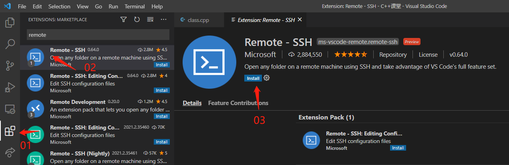
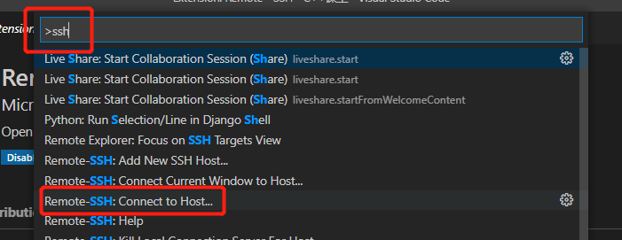
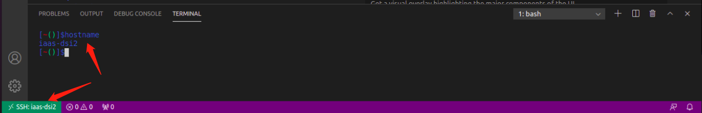
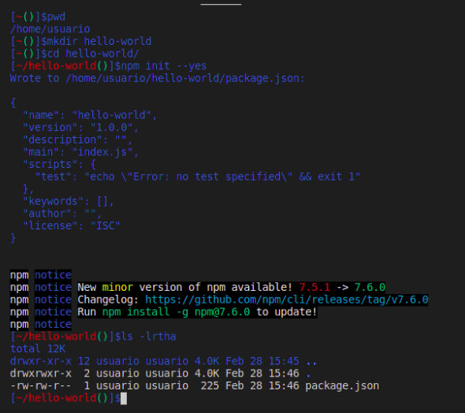
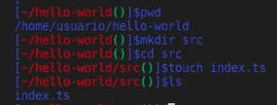
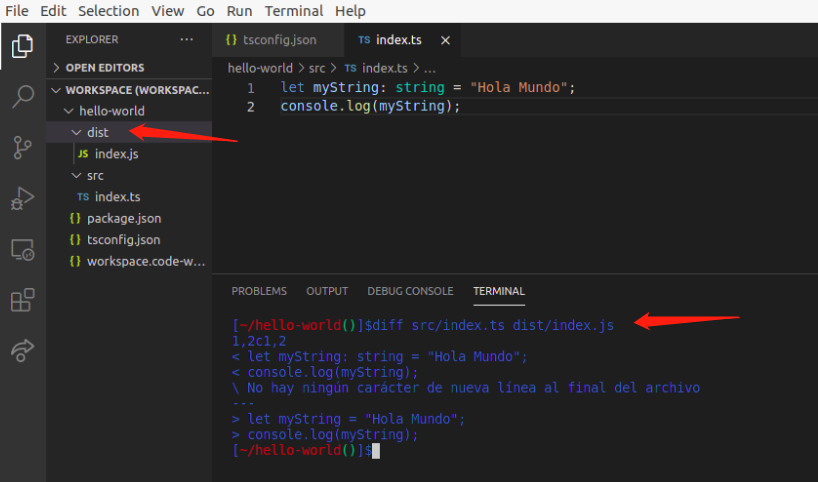
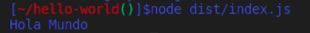

# Práctica 2: Instalación y configuración de Visual Studio Code

```
Universidad: Universidad de La laguna
Asignatura: Desarrollo de Sistemas Informaticos
Curso: 2020 - 2021
Autor: XueMei Lin
```

## 1. Introducción
[Visual Studio Code](https://es.wikipedia.org/wiki/Visual_Studio_Code) es un editor de código fuente desarrollado por Microsoft para Windows, Linux y macOS. Incluye soporte para la [depuración](https://es.wikipedia.org/wiki/Depuración_de_programas), control integrado de [Git](https://es.wikipedia.org/wiki/Git), resaltado de sintaxis, finalización inteligente de código, fragmentos y refactorización de código. Es una herramienta potente para los desarrolladores, por lo tanto nos ayuda a trabajar más cómodamente y fácilmente.

## 2. Objetivo

Respecto a la práctica, vamos a [Desgarcar Visual Studio Code](https://code.visualstudio.com/) y hacer la configuración necesaria para poder trabajar en nuestra asignatura de Desarrollo de Sistemas Informáticos. Más concretamente, vamos a utilizar esta herramienta potente para conocer un poco sobre **TypeScript**, y vamos a crear nuestro primer proyecto en TypeScript.

## 3. Instalación y configuración de Visual Studio Code

### 3.1. Instalación y funcionalidad de Visual Studio Code

En primer lugar tenemos que [instalar VSC](https://code.visualstudio.com/), también podemos utilizar el siguiente comando:

```
lyz@lyzpc:~$ sudo apt install code
```

Así ya tenemos nuestro VSC instalado.

### 3.2. Configuración de Visual Studio Code para conectarse a una máquina remota por SSH

Después de descargarse VSC, descargar las extensiones necesarias:

1. **Remote - SSH**

 

y ahora, pulsamos la tecla **F1** o  **Ctrl + Shift + P**

nos va aparecer una venta como:



Como hemos hecho la configuración sobre nuestra máquina local con la máquina virtual, podemos conectar desde directamente con el host **iaas-dsi2**.  Nos llevará a abrir una nueva ventana de VSC. Para comprobar que nos hemos conectado de forma correctamente, podemos observar la zona izquierda inferior:



o haciendo uso en el terminal de VSC el siguiente comando:

```
[~()]$hostname
iaas-dsi2
```

Efectivamente tenemos conectado a nuestra máquina virtual.

### 3.2. Sesiones colaborativas con Visual Studio Live Share

A veces es importante trabajar en equipo, por lo tanto, VSC tiene una extensión que se denomina **Live Share Extension Pack**. La funcionalidad de dicho extensión es trabajar con los compañeros de forma junta y remota. 

Simplemente descargamos la extensión [Live Share Extension Pack](https://marketplace.visualstudio.com/items?itemName=MS-vsliveshare.vsliveshare-pack) y compartimos el enlace con otros compañeros, así ya podemos iniciar a trabajar en equipo.

### 3.3. Primer proyecto en TypeScript: “Hola Mundo”
Para iniciar VSC con nuestro primer proyecto en TypeScript, es recomendable descargar las siguientes extensiones:

* [Vim](https://es.wikipedia.org/wiki/Vim)
* [ESLint](https://lenguajejs.com/javascript/caracteristicas/eslint/) 

A continuación, instalamos el compilador de TypeScript y comprobamos su versión:
```
[~()]$npm install --global typescript

added 1 package, and audited 2 packages in 2s

found 0 vulnerabilities
[~()]$tsc --version
Version 4.2.2
```

Ahora ejecutamos los siguientes pasos para crear el primer proyecto en TypeScript:



Los pasos que hemos seguidos son:

1. ***pwd*** : Mirar directorio actual donde estamos situado.

2. ***mkdir hello-world*** : Crear un nuevo directorio llamado ¨hello-world¨.

3. ***cd hello-world*** : Entramos el directorio ¨hello-world¨.

4. ***npm init --yes*** : permite la creación de un fichero *package.json*, con el fin de establecer las dependencias de desarrollo y ejecución del proyecto a modo de paquetes de los que depende el proyecto actual.

5. ***ls -lrtha*** : Mirar los archivos que están en el directorio actual.

Abrimos el directorio de ¨hello-world¨ en el explorador de VSC o también podemos [crear un espacio de trabjo](https://stackoverflow.com/questions/53308870/how-to-create-a-workspace).
1. ***File***
2. ***Open Folder***
3. ***/home/usuario/hello-world***

Ahora, vamos a crear un archivo en el directorio ¨hello-world¨ denominado ***tscofig.json***.
```
[~/hello-world()]$touch tsconfig.json
[~/hello-world()]$cat tsconfig.json
{
  "compilerOptions": {
    "target": "ES2018",
    "outDir": "./dist",
    "rootDir": "./src",
    "module": "CommonJS"
  }
}
```
Los que hace este fichero son: 

1. Generar código compatible con uno de últimos estándares de JavaScript.

2. El código de JavaScript después de compilar se almacenará en un directorio ***dist***.

3. El código fuente escrito en TypeScript esta en el directorio ***src***.

4. Un estándar para cargar código desde ficheros independientes.

**Empezamos a crear nuestro primer proyecto llamado** ***index.ts***:



Utilizando los comandos que han puesto en la imagen anterior y ponemos el siguiente contenido:
```
let myString: string = "Hola Mundo";
console.log(myString);
```

y luego tenemos que compilar el código:
```
[~/hello-world()]$tsc
```

Nos generará un directorio ***dist***, donde está nuestro código compilado, podemos utilizar el siguiente comando para mirar la diferencia entre estos dos ficheros.
```
[~/hello-world()]$diff src/index.ts dist/index.js
```


Y por último, ejecutamos el código JavaScript que ha generado a partir del código TypeScript:




## 4. Conclusiones

Como conclusión, respecto a las extensiones, son muy útiles a la hora de trabajar tanto individualmente como en equipo. Aprenderé más cosas por mi cuenta sobre más extensiones. Además, hemos creado nuestro primer proyecto en TypeScript, es muy interesante todo el proceso. 


## 5. Bibliografía

Instalar VSC: https://code.visualstudio.com/docs/setup/setup-overview

Compilar JavaScript en VSC: https://code.visualstudio.com/docs/languages/javascript
